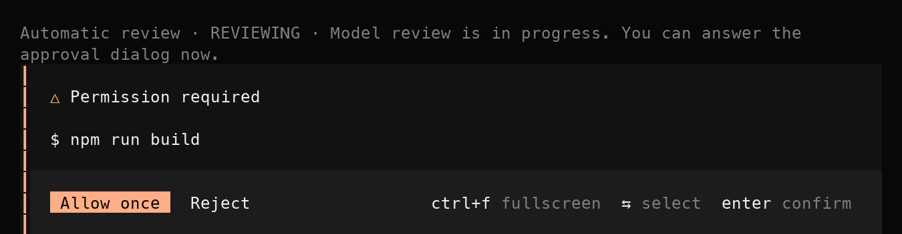
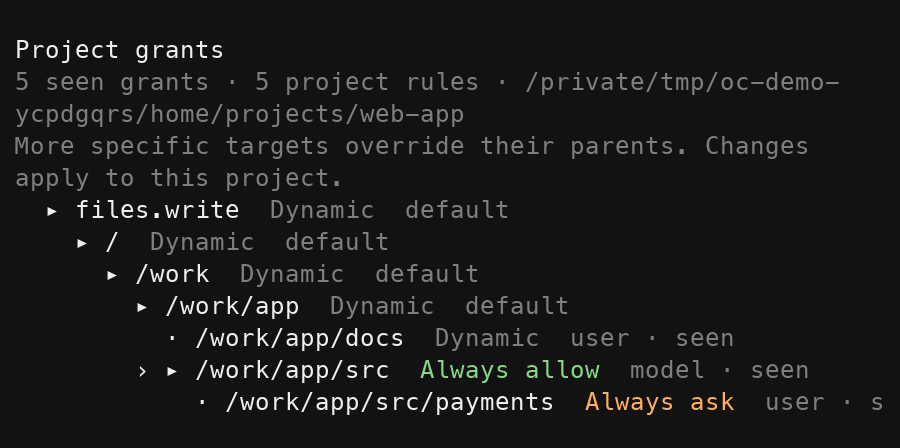
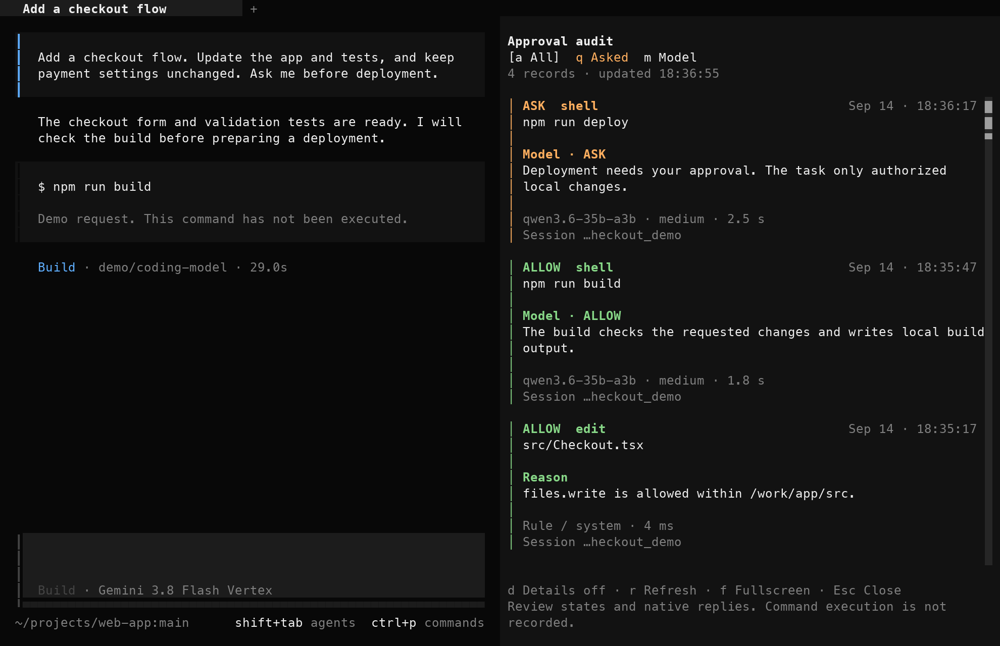

# OpenCode Auto Approve

Spend less time approving routine reads and edits. Keep control over what your agent can change.

OpenCode Auto Approve answers routine permission requests for you. It uses saved rules and an AI model to check actions against your instructions.

For **OpenCode 2.0.2** on **macOS and Linux**. Choose the AI model for permission checks through an OpenAI-compatible endpoint.

[Get started](#get-started) · [Project grants](#set-permissions-that-fit-your-project) · [Audit trail](#see-why-the-plugin-approved-an-action)

## Automatic approvals for routine work

When an action needs permission, the plugin first checks your saved rules. Recognized reads, searches, and read-only Git commands can pass immediately when those rules permit them.

For requests that the rules leave undecided, a separate AI model checks the proposed action against your task instructions. It can approve the request or explain why it needs your decision.

You can still choose **Allow once** or **Reject** in the approval dialog while this check runs. If the model approves before you answer, the dialog closes and your agent continues. If you answer first, your decision takes precedence.



_Screenshots show the actual OpenCode TUI with sample sessions, grants, and review results. The displayed timings illustrate the interface._

The model has three choices:

- **Allow once:** approve this request and continue.
- **Escalate once:** ask you, with an explanation.
- **Allow always:** save a permission for a specific operation and target in this project.

For example, you can authorize edits under `src` while requiring approval before deployment. The model can remember a permitted scope, so later requests can pass through the rules without another model call.

The model may remember deployment or other consequential operations only when your instructions explicitly authorize repeated use.

## Set permissions that fit your project

Commands share permissions for their effects. For example, `cat src/a.ts` and `head -20 src/b.ts` can use one `files.read` rule for `src`.

A command passes immediately only when the parser understands every effect and all its grants allow the action. Any effective **Always ask** rule sends the request directly to you. Unknown effects require an AI decision for that request and create no command entry in the grant tree.

### Reuse permissions across worktrees

The tree labels linked checkout targets as `<repository> · scratch · <relative path>`. A permission for `infra · scratch · services/accountant` also applies in later worktrees of that repository.

These rules stay within the current OpenCode project. They cover neither the main checkout nor another repository. A project can hold separate rules for several repositories. Git linkage verification establishes each repository's identity.

Press **Ctrl+G** or run **`/approval-grants`** to open the project grant tree. It shows observed operations, their target paths, and the rules that apply.



Each grant has one of three modes:

| Mode             | What happens                                                         |
| ---------------- | -------------------------------------------------------------------- |
| **Always allow** | The rule permits this operation within its target scope.             |
| **Always ask**   | The request goes directly to you.                                    |
| **Dynamic**      | The model decides whether to approve, escalate, or remember a scope. |

A more specific target can override its parent. In the example, the `src` rule allows edits, while changes under `src/payments` require approval.

Use the arrow keys to select a scope. Press **A** for Always allow, **S** for Always ask, or **D** for Dynamic. Press **/** to filter by path or operation. The selected entry shows who set its rule and why.

Saved project rules apply across sessions in that OpenCode project. You can change them later, including during pending reviews. File edits and local Beads updates have separate permissions.

Use the grant tree to manage operation and path scopes. The **Always allow** option in the native dialog saves native patterns, which can be broader. See [native permission boundaries](docs/configuration.md#native-permission-boundaries) if you already have broad shell permissions.

## See why the plugin approved an action

Run **`/approval-audit`** to open the audit panel beside your session. Each entry shows the action, decision, reason, source, and review time.



Filter to **Asked** to inspect escalations, or **Model** to inspect model decisions. Press **D** for record identifiers and timestamps. Press **F** to expand the panel.

For a separate terminal view:

```sh
oc-approvals --follow
oc-approvals --details --limit 5
oc-approvals --json --limit 1
```

`--details` expands each entry with parsed grants, their states, matched rules, and unresolved effects. Saved rule events show which rules changed and the resulting grant states.

These states describe the recorded decision and save transaction. They do not reinterpret old decisions using today's rules. Older records show the available evidence and identify missing change history.

`--json` emits JSON Lines with the complete stored detail payload. This replaces the previous `--details` JSON output. Combine either format with `--follow`, `--session`, or `--decision`.

Colors distinguish approvals (green), requests for approval (amber), denials (red), and dynamic grants (cyan). Long paths use a shared path key, and the layout wraps to your terminal width. Colors turn off in redirected output. Set `NO_COLOR=1` or use `--color never` to disable them; use `--color always` with `less -R` to keep them in a pager.

Detailed local records support deeper investigation. They describe permission decisions, not proof that a command ran or succeeded. See [audit data and privacy](SECURITY.md).

On macOS, notifications alert you when review escalates, fails, or remains pending for five minutes. Run **`/approval-notification-test`** to check notification delivery.

## Start with useful defaults

The plugin starts with rules for project reads, read-only Git inspection, `AGENTS.md`, skill reads, task scratch files, and agent coordination. Targets follow the current session and your configured directories.

The installer includes these rules automatically. Project edits, test execution, and Beads updates need an AI decision until you or the model save suitable permissions.

See the [starter rule catalog](docs/starter-rules.md) for defaults, optional JSON examples, and local shell setup requirements.

## Get started

Requirements: **OpenCode 2.0.2**, Node.js 22+, Python 3.10+, and Go 1.26+. OpenCode 1.x and Windows are not supported.

1. Clone the plugin into a directory that you will keep.

   ```sh
   git clone https://github.com/mersinvald/opencode-auto-approve.git
   cd opencode-auto-approve
   npm ci
   ```

2. Add an AI model for permission checks to your OpenCode profile using the [provider example](docs/configuration.md#classifier-provider).

   The endpoint must support Chat Completions, tool calls, and the configured reasoning variant.
   The example uses `review`, `classifier`, and `medium` as the identifiers for the next step.

3. Install in **shadow mode** to inspect decisions before enabling automatic approval.

   ```sh
   python3 install.py --provider review --model classifier --variant medium --mode shadow
   python3 build_static.py --config-root "$HOME/.config/opencode"
   ```

   Use your own provider, model, and variant identifiers if they differ from the example.
   For a custom profile, pass `--config-root` to both scripts.

4. Restart OpenCode.

5. Inspect **`/approval-audit`** during a task.

   Shadow mode records proposed decisions and leaves native approval requests for you.

6. When the audit matches your intended policy, enable automatic approval.

   ```sh
   python3 install.py --mode enforce
   ```

7. Restart OpenCode to load the installed version.

The installer backs up changed files and preserves existing models, grants, and plugin entries. It leaves Slim and agent prompts unchanged. Keep this checkout and its `node_modules` directory available.

Automatic approval does not sandbox commands. Model decisions can be wrong. Read the [security boundaries](SECURITY.md) before enabling it.

## More documentation

- [Configuration, upgrades, and removal](docs/configuration.md)
- [How permission decisions work](docs/architecture.md)
- [Tests and infrastructure runners](docs/testing.md)
- [Contributing](CONTRIBUTING.md)
- [Third-party notices](THIRD_PARTY_NOTICES.md)

## License

[MIT](LICENSE). The shell parser uses `mvdan.cc/sh/v3` under its separate BSD 3-Clause license.
